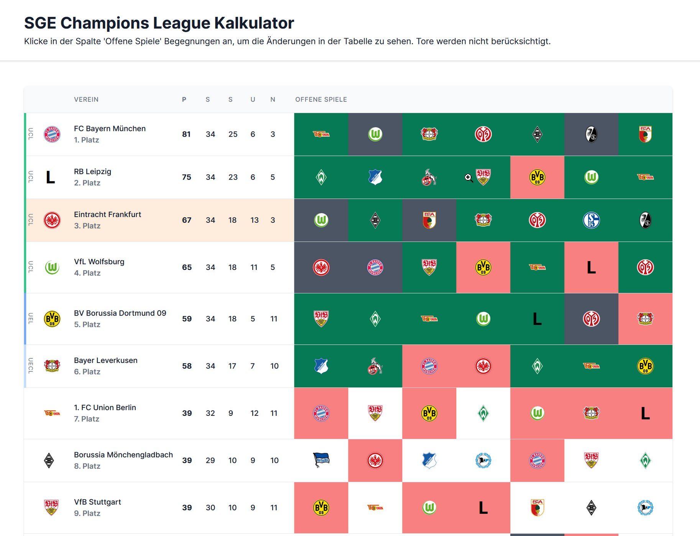
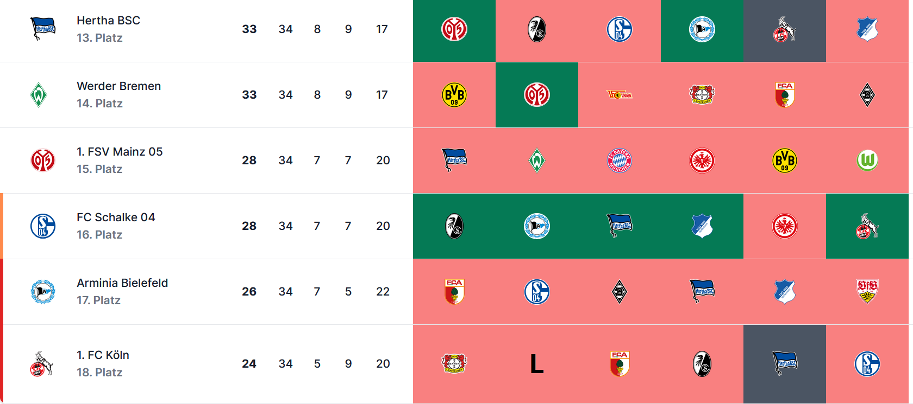

<h1 align="center">
  <a href="https://github.com/54m1r/sge-cl-calc">
    <!-- Please provide path to your logo here -->
    
  </a>
</h1>

  sge-cl-calc
   
  <a href="#about"><strong>Explore the screenshots »</strong></a>
   
   
  <a href="https://github.com/54m1r/sge-cl-calc/issues/new?assignees=&labels=bug&template=01_BUG_REPORT.md&title=bug%3A+">Report a Bug</a>
  ·
  <a href="https://github.com/54m1r/sge-cl-calc/issues/new?assignees=&labels=enhancement&template=02_FEATURE_REQUEST.md&title=feat%3A+">Request a Feature</a>
  .
  <a href="https://github.com/54m1r/sge-cl-calc/issues/new?assignees=&labels=question&template=04_SUPPORT_QUESTION.md&title=support%3A+">Ask a Question</a>

 

Table of Contents

- [About](#about)
  - [Built With](#built-with)
- [Getting Started](#getting-started)
  - [Prerequisites](#prerequisites)
  - [Installation](#installation)
- [Roadmap](#roadmap)
- [Authors & contributors](#authors--contributors)
- [License](#license)

---

## About

When Eintracht Frankfurt reached the Champions League places in the final phase of the 20/21 season, I developed a small tool with which the effects of the games on the Bundesliga table can be displayed easily and clearly. 

Screenshots

 

|                               1                               |                               2                                |
| :-------------------------------------------------------------------: | :--------------------------------------------------------------------: |
|  |  |

### Built With

VueJS 
Tailwind

## Getting Started

### Prerequisites

NodeJS 
NPM

### Installation
npm install 
npm run serve

## Roadmap

See the [open issues](https://github.com/54m1r/sge-cl-calc/issues) for a list of proposed features (and known issues).

- [Top Feature Requests](https://github.com/54m1r/sge-cl-calc/issues?q=label%3Aenhancement+is%3Aopen+sort%3Areactions-%2B1-desc) (Add your votes using the 👍 reaction)
- [Top Bugs](https://github.com/54m1r/sge-cl-calc/issues?q=is%3Aissue+is%3Aopen+label%3Abug+sort%3Areactions-%2B1-desc) (Add your votes using the 👍 reaction)
- [Newest Bugs](https://github.com/54m1r/sge-cl-calc/issues?q=is%3Aopen+is%3Aissue+label%3Abug)

## Authors & contributors

The original setup of this repository is by [54m1r](https://github.com/54m1r).

For a full list of all authors and contributors, see [the contributors page](https://github.com/54m1r/sge-cl-calc/contributors).

## License

This project is licensed under the **MIT license**.

See [LICENSE](LICENSE) for more information.
